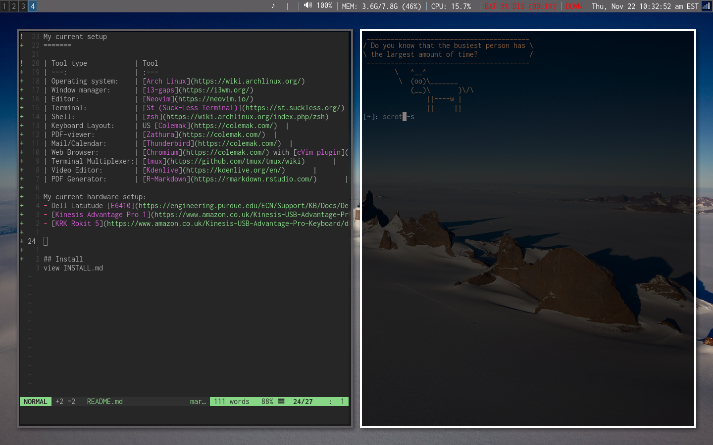

My current setup
=======

| Tool type            | Tool                                                       |
| ---:                 | :---                                                       |
| Operating system:    | [Arch Linux](https://wiki.archlinux.org/)                  |
| Window manager:      | [i3-gaps](https://i3wm.org/)                               |
| Editor:              | [Neovim](https://neovim.io/)                               |
| Terminal:            | [St (Suck-Less Terminal)](https://st.suckless.org/)        |
| Shell:               | [zsh](https://wiki.archlinux.org/index.php/zsh)            |
| Keyboard Layout:     | US [Colemak](https://colemak.com/)  |
| PDF-viewer:          | [Zathura](https://colemak.com/)  |
| Mail/Calendar:       | [Thunderbird](https://colemak.com/)  |
| Web Browser:         | [Chromium](https://colemak.com/) with [cVim plugin](https://chrome.google.com/webstore/detail/cvim/ihlenndgcmojhcghmfjfneahoeklbjjh)|
| Terminal Multiplexer:| [tmux](https://github.com/tmux/tmux/wiki)       |
| Video Editor:        | [Kdenlive](https://kdenlive.org/en/)       |
| PDF Generator:       | [R-Markdown](https://rmarkdown.rstudio.com/)       |

My current hardware setup:
- Dell Latutude [E6410](https://engineering.purdue.edu/ECN/Support/KB/Docs/DellModelYears) 2010
- [Kinesis Advantage Pro 1](https://www.amazon.co.uk/Kinesis-USB-Advantage-Pro-Keyboard/dp/B004X9B3JQ)
- [KRK Rokit 5](https://www.amazon.co.uk/Kinesis-USB-Advantage-Pro-Keyboard/dp/B004X9B3JQ) for music

## Install
 -   `cd ~`
 -   `git clone`
 -   `cd dotfiles && ./install.sh`
